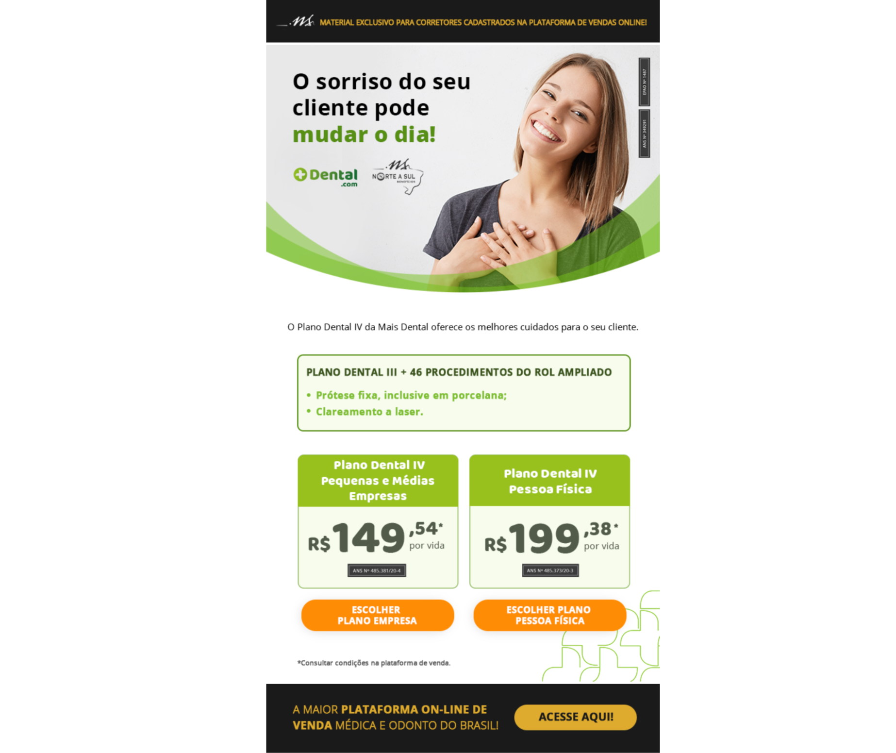

# Etapa 02 - processo seletivo Marlin

Nesta etapa, desenvolvi um E-mail marketing da Mais dental, para o processo seletivo de estágio da Marlin.

### Screenshot

### Links
- [repositório](https://github.com/JimCarey08/etapa_02-processoMarlin/)
- [email-live]()

## Processo de desenvolvimento

### desenvolvido com:

- HTML5
- tabelas HTML

### Como foi o processo:

Nessa etapa, basicamente utilizei as tabelas de Html e suas propriedades para posicionar as imagens fornecidas afim de reproduzir o desafio dado.

